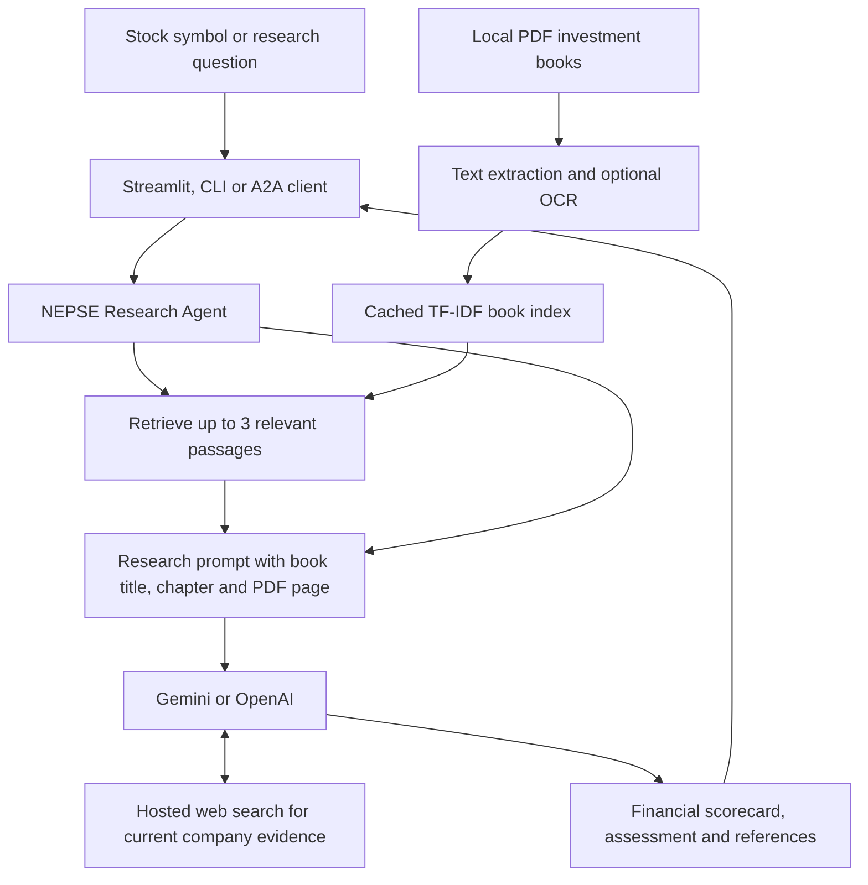

# Stocks Research Agent

A research assistant for Nepal Stock Exchange (NEPSE) markets, companies and the economy. It combines current web evidence with relevant passages from your investment books using **retrieval-augmented generation (RAG)**. Ask about a stock to receive a financial scorecard, an investment assessment and supporting references. Built with Google Gemini or OpenAI and the **Agent-to-Agent (A2A) Protocol (v1.0)**.

Repository: [`stocks-research-agent`](https://github.com/Dhakal29/stocks-research-agent).

The repository includes:
- **A2A Server**: Standard JSON-RPC (`SendMessage`) service exposing an `AgentCard` at `/.well-known/agent-card.json`.
- **NEPSE Research Engine**: Internet search across multiple websites using **Google Gemini** (`gemini-3.5-flash-lite`) or **OpenAI**, with dated market information, fundamentals, news and citations.
- **Local Book Knowledge Store**: Extracts and indexes PDFs from `training_books/`, then retrieves relevant investment principles for the model's research prompt.
- **Interactive Chat UI**: Streamlit web chat with conversation history and automated server fallback.
- **CLI Tools & Client**: Query agents directly, via CLI, or over the network.

---

## Architecture



Book retrieval happens before the model request. The model receives those
passages and uses its web-search tool to gather current evidence within the
same research request. The CLI and A2A server use the same research engine.

---

## Features

- **Standard A2A Protocol**: Fully compliant `AgentCard` metadata, task state lifecycle (`TASK_STATE_WORKING` -> `TASK_STATE_COMPLETED`), and structured report artifacts.
- **Book-Based RAG Context**: Retrieves passages from `training_books/*.pdf` using TF-IDF and cosine similarity. Each passage retains its book filename, chapter and PDF page number.
- **Financial Scorecard and Investment Assessment**: Full company reports request Pass / Caution / Fail assessments of profitability, leverage, cash flow and valuation, with strengths, risks and book references. Verdicts include `[INVESTMENT GRADE / ATTRACTIVE]`, `[MODERATE / FAIR VALUE (HOLD)]` and `[AVOID / HIGH RISK]`.
- **Persistent Local Index**: Caches extracted passages in `.rag_index.json` and rebuilds when PDF contents or the set of books changes. Common abbreviations such as EPS, ROE, P/E and P/B are expanded during retrieval.
- **Optional Local OCR**: A Python indexing option uses macOS Vision and Swift to recognize text in scanned PDF pages. Extraction status and skipped-page warnings help identify books missing from the index.
- **Fundamentals and News**: Searches for the latest available prices, financial metrics, dated company results and corporate announcements.
- **Answers Based on the Query**: Supports today's market summary, news, sector analysis, comparisons, economic questions and other research topics. A stock symbol is optional; a bare symbol still requests a full company report.
- **Multiple Website Sources**: Requires citations from at least two publisher sites, with one further search attempt when coverage is insufficient. Configure the threshold with `NEPSE_MIN_SITES`.
- **Readable Reports and Research Logs**: The Streamlit UI places the web source list in an expandable section. Terminal logs show indexing, search progress, source coverage and the investment verdict when detected.
- **Multiple Interfaces**:
  - Interactive Web Chat UI (Streamlit)
  - HTTP JSON-RPC Server
  - CLI Direct Research (`python -m nepse_agent research`)
  - Inter-Agent Python Client (`nepse_agent.client.ask_agent`)

---

## Installation & Setup

1. **Clone the repository**:
   ```bash
   git clone https://github.com/Dhakal29/stocks-research-agent.git
   cd stocks-research-agent
   ```

2. **Create and activate a virtual environment**:
   ```bash
   python -m venv .venv
   source .venv/bin/activate
   ```

3. **Install dependencies**:
   ```bash
   pip install -r requirements.txt
   ```

4. **Configure API Keys**:
   Create a `.env` file in the root directory:
   ```bash
   GEMINI_API_KEY="your-gemini-api-key"
   GEMINI_MODEL="gemini-2.5-flash"
   NEPSE_PROVIDER="gemini"
   NEPSE_MIN_SITES=2
   # Optional: OPENAI_API_KEY="your-openai-api-key"
   ```

   Gemini is the default provider. To use OpenAI, set `NEPSE_PROVIDER="openai"`
   and provide `OPENAI_API_KEY`.

5. **Add your investment books**:
   ```bash
   mkdir -p training_books
   ```
   Place PDF files directly in `training_books/`. This folder is git-ignored;
   each installation needs its own copies of the books. The first research
   request builds the local index automatically. See the setup and inspection
   commands below to verify retrieval before making a provider request.

---

## RAG: Analyze Stocks Using Investment Books

The books supply investment principles, while web search supplies dated company
information. For example, retrieved passages about cash flow or leverage can
help the model interpret the stock's financial results. The model is instructed
to reference book principles when explaining a company assessment.

### Indexing and retrieval

1. `pypdf` extracts text from each PDF page.
2. Text is split into windows of up to **350 words**, with **50 words of overlap**
   within a page. Chunks retain the filename, detected chapter and PDF page.
3. The store builds **TF-IDF word vectors** and ranks passages by **cosine
   similarity**. It uses local lexical retrieval, with abbreviation expansion
   and stop-word filtering.
4. For each research request, the user's query is expanded with investment
   topics such as due diligence, valuation, return on equity and debt. The
   **top three matching chunks** are added to the model's instructions.
5. Gemini or OpenAI combines the supplied context with its web-search evidence
   to write the requested report.

The default cache is `training_books/.rag_index.json`. SHA-256 fingerprints
detect added, removed or changed PDFs. Indexing and retrieval run locally;
the selected passages are sent to your configured model provider with the
research request.

### Inspect the knowledge store locally

Run from the repository root after activating the virtual environment:

```bash
python - <<'PY'
from nepse_agent.agent import configure_research_logging
from nepse_agent.rag_engine import get_rag_store

configure_research_logging()
store = get_rag_store()
print(f"Indexed {len(store.chunks)} passages")
for book in store.book_status:
    print(f"{book['filename']}: {book['indexed_pages']}/{book['total_pages']} pages indexed")
for chunk in store.retrieve("cash flow earnings quality debt equity valuation", top_k=3):
    print(f"\n{chunk.book_title} | {chunk.chapter} | PDF page {chunk.page_number}")
    print(chunk.content)
PY
```

This inspects local retrieval without calling the model or web-search API.
Page numbers refer to the PDF's page order and may differ from printed page
numbers in the book.

### Scanned PDFs and OCR

Pages with fewer than 40 extracted characters are treated as lacking usable
text and skipped during ordinary indexing. A scanned book such as
`UNIT2-FUNDAMENTAL-ANALYSIS-TECHNICAL-ANALYSIS-min.pdf` needs OCR to contribute
text passages. Check `store.warnings` and `store.book_status` for skipped pages.

On **macOS with Swift available**, build the index with local OCR enabled:

```bash
python - <<'PY'
from nepse_agent.agent import configure_research_logging
from nepse_agent.rag_engine import BookRAGStore

configure_research_logging()
store = BookRAGStore()
store.load_or_build(ocr=True)
for book in store.book_status:
    print(f"{book['filename']}: {book['indexed_pages']}/{book['total_pages']} pages indexed")
for warning in store.warnings:
    print(warning)
PY
```

The OCR helper uses Apple's PDFKit and Vision frameworks with English text
recognition. It preserves the source PDFs and caches recognized text in
`.ocr_cache/` beside the index. Later research requests reuse the OCR-enabled
index. After adding or replacing books, rerun OCR indexing to keep scanned
pages included. On other operating systems, add a searchable text layer to
scanned PDFs before indexing. Review OCR results before relying on financial
formulas or tables extracted from images.

### Configuration and rebuilding

| Setting | Default | Purpose |
| --- | --- | --- |
| `NEPSE_BOOKS_DIR` | Repository's `training_books/` | Directory containing the PDF books |
| `NEPSE_BOOK_INDEX` | `<books directory>/.rag_index.json` | Location of the extracted-passage cache |

Set these in `.env` or export them before starting the app. To rebuild manually,
call `BookRAGStore().load_or_build(force_rebuild=True)`, adding `ocr=True` when
needed. Book-index operations currently use the Python API; the terminal
subcommands are `research`, `serve` and `ask`.

### Request a stock assessment

```bash
python -m nepse_agent research "Analyze NABIL using the investment books and latest financial statements"
python -m nepse_agent research "Evaluate SHIVM cash flow, debt and valuation using the books"
python -m nepse_agent research "Compare NABIL and EBL using fundamental analysis principles"
```

A full company report requests an executive snapshot, a fundamentals table,
a due diligence scorecard, an investment verdict with reasons, and dated
corporate actions. The current prompt includes profitability and Graham-style
valuation benchmarks alongside retrieved book context. These benchmarks and
their suitability for the company's sector need review.

Book references and the scorecard are generated by the model. The application
checks web-source coverage but does not independently validate each financial
calculation or book citation. The JSON `cited_sources` field contains web
sources; it does not currently expose retrieved book passages as a separate
citation collection. If book retrieval fails, the agent logs
`Could not retrieve RAG knowledge` and continues with web research, so inspect
the logs when confirming that a report used your books.

---

## Running the Project

### Option 1: Interactive Chat UI (Streamlit)

Launch the web chat interface:
```bash
streamlit run chat_ui.py
```
Open `http://localhost:8501` in your browser. Ask a question such as:

- "Give me today's market summary."
- "Which NEPSE sectors performed best this week?"
- "Compare NABIL and EBL's latest financial results."
- "Analyze NABIL using my investment books and explain the verdict."
- "What are the latest IPO announcements in Nepal?"
- "How do interest rates affect Nepal's stock market?"

You can also enter a stock symbol (e.g., `NABIL`) for a full company report.
Unspecified market questions default to NEPSE; name another market explicitly
to research it. The answer follows the question's topic, timeframe, language
and requested level of detail.

---

### Option 2: Running as an A2A Server (For Multi-Agent Systems)

Start the A2A server daemon:
```bash
python -m nepse_agent serve --port 10000
```

1. **Verify Discovery (`AgentCard`)**:
   ```bash
   curl http://127.0.0.1:10000/.well-known/agent-card.json
   ```

2. **Query from another terminal using the A2A Client**:
   ```bash
   python -m nepse_agent ask "NABIL" --url http://127.0.0.1:10000
   ```

3. **Or call via direct JSON-RPC**:
   ```bash
   curl -X POST http://127.0.0.1:10000/ \
     -H "Content-Type: application/json" \
     -H "A2A-Version: 1.0" \
     -d '{
       "jsonrpc": "2.0",
       "id": "1",
       "method": "SendMessage",
       "params": {
         "message": {
           "role": "ROLE_USER",
           "parts": [{"text": "SHIVM"}]
         }
       }
     }'
   ```

---

### Option 3: Quick Direct CLI Research

Run research directly without starting an HTTP server:
```bash
python -m nepse_agent research "NABIL"
python -m nepse_agent research "Give me today's market summary"
python -m nepse_agent research "Latest Nepal economic news in Nepali"
```
Or output raw JSON data:
```bash
python -m nepse_agent research "NABIL" --json
```

The Gemini backend registers `types.Tool(google_search=types.GoogleSearch())`.
Its returned grounding metadata supplies the actual search queries and source
citations. The JSON report includes `source_domains`, `search_queries`,
`cited_sources` and Google Search suggestions for graphical clients.
The model plans searches from the user's question, starts with broad web searches,
then checks relevant primary sources and other publishers. It is not restricted
to MeroLagani or a fixed list of sites. Search retrieves relevant accessible
evidence; it cannot read the entire internet. For today's summaries, the model
is instructed to verify the actual session date, label intraday data and identify
older data when today's figures are unavailable.
See [the search-tool and source-coverage guide](nepse_agent/README.md#internet-search-tool-and-source-coverage)
for configuration and [Google's grounding documentation](https://ai.google.dev/gemini-api/docs/generate-content/google-search)
for the API contract. Prices retain their source dates; search does not guarantee
a live quote or access to paywalled financial data.

---

## Running Automated Tests

Run the test suite with pytest:
```bash
python -m pytest -q -p no:cacheprovider tests
```

---

## Project Structure

```text
.
├── .env                       # API keys (git-ignored)
├── requirements.txt           # Production dependencies
├── chat_ui.py                 # Streamlit chat interface
├── training_books/            # Local PDF books and RAG cache (git-ignored)
│
├── nepse_agent/               # Research engine and A2A integration
│   ├── agent.py               # Book-context injection, web search, citations & synthesis
│   ├── rag_engine.py          # PDF extraction, chunking, TF-IDF retrieval & caching
│   ├── ocr_books.swift        # Optional macOS OCR for scanned PDF pages
│   ├── server.py              # A2A AgentCard & JSON-RPC server routes
│   ├── client.py              # A2A client helper for inter-agent communication
│   └── __main__.py            # CLI entry point (serve, research, ask)
│
└── tests/
    └── test_nepse_agent.py    # Unit tests for A2A compliance & agent logic
```
