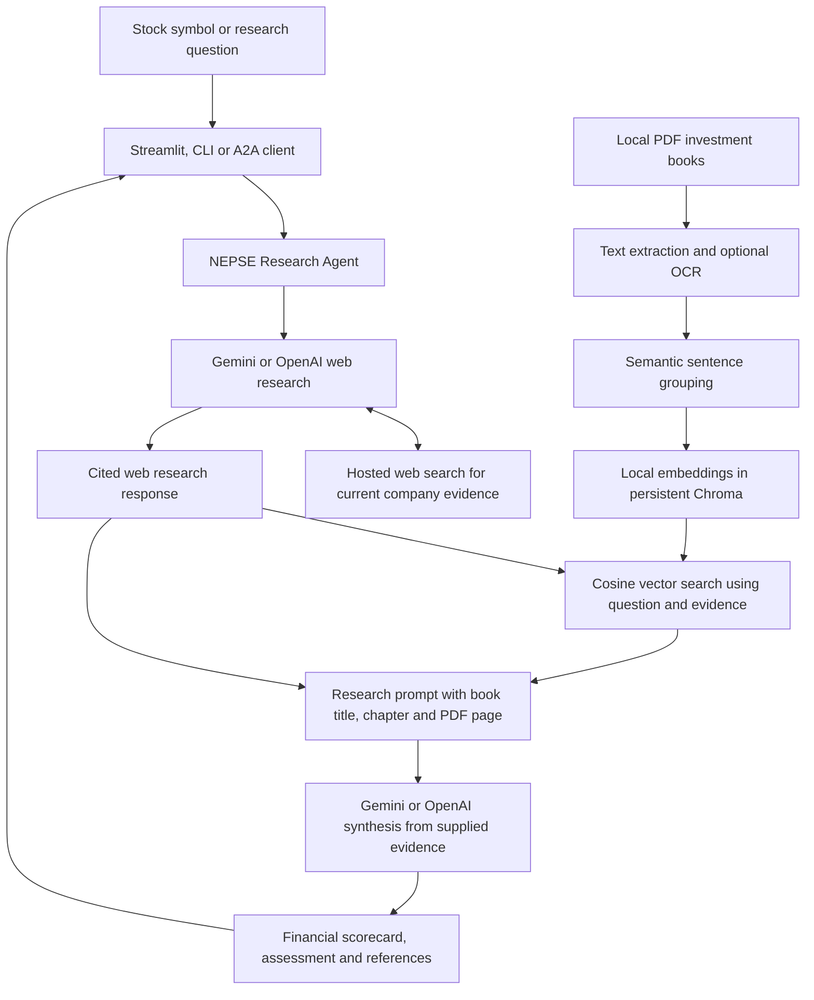

# Stocks Research Agent

A research assistant for Nepal Stock Exchange (NEPSE) markets, companies and the economy. It combines current web evidence with relevant passages from your investment books using **retrieval-augmented generation (RAG)**. Ask about a stock to receive a financial scorecard, an investment assessment and supporting references. Built with Google Gemini or OpenAI and the **Agent-to-Agent (A2A) Protocol (v1.0)**.

Repository: [`stocks-research-agent`](https://github.com/Dhakal29/stocks-research-agent).

The repository includes:
- **A2A Server**: Standard JSON-RPC (`SendMessage`) service exposing an `AgentCard` at `/.well-known/agent-card.json`.
- **NEPSE Research Engine**: Internet search across multiple websites using **Google Gemini** (`gemini-3.5-flash-lite`) or **OpenAI**, with dated market information, fundamentals, news and citations.
- **Local Book Knowledge Store**: Extracts and indexes PDFs from `training_books/`, then retrieves relevant investment principles for the model's research prompt.
- **Interactive Chat UI**: Streamlit web chat with conversation history and automated server fallback.
- **CLI Tools & Client**: Query agents directly, via CLI, or over the network.

---

## Architecture



For a bare stock symbol or an analysis/investment question, web research runs
first. Its response and investment questions drive semantic book retrieval;
a second model call writes the assessment from those sources without another
web search. General market summaries and news retain a single research stage. Set
`NEPSE_RAG_WEB_FIRST=0` to retrieve books before the original single-stage
request instead. The CLI and A2A server use the same research engine.

---

## Features

- **Standard A2A Protocol**: Fully compliant `AgentCard` metadata, task state lifecycle (`TASK_STATE_WORKING` -> `TASK_STATE_COMPLETED`), and structured report artifacts.
- **Semantic Book Retrieval**: Groups sentences by shifts in embedding similarity, then searches local FastEmbed vectors in persistent Chroma using cosine similarity. Passages retain their book filename, detected chapter and exact PDF page.
- **Financial Scorecard and Investment Assessment**: Full company reports request Pass / Caution / Fail assessments of profitability, leverage, cash flow and valuation. The prompt separates business quality from valuation and uses only supplied book references.
- **Persistent Local Index**: Caches passage metadata in `.rag_index.json`, vectors in `.rag_vectors/`, and the pretrained model in `.embedding_models/`. Changed PDFs, embedding models or chunking settings trigger reindexing; legacy TF-IDF indexes migrate automatically.
- **Retrieval Logs and Book Sources**: Logs show the web response used for retrieval, exact vector query strings, cosine scores, rejected matches and passages passed to the model. JSON reports expose these supplied passages in `book_sources`; unknown book citation IDs are rejected.
- **Optional Local OCR**: A Python indexing option uses macOS Vision and Swift to recognize text in scanned PDF pages. Extraction status and skipped-page warnings help identify books missing from the index.
- **Fundamentals and News**: Searches for the latest available prices, financial metrics, dated company results and corporate announcements.
- **Answers Based on the Query**: Supports today's market summary, news, sector analysis, comparisons, economic questions and other research topics. A stock symbol is optional; a bare symbol still requests a full company report.
- **Multiple Website Sources**: Requires citations from at least two publisher sites, with one further search attempt when coverage is insufficient. Configure the threshold with `NEPSE_MIN_SITES`.
- **Temporary Gemini Error Recovery**: Retries temporary HTTP 429 and 500/502/503/504 failures twice with exponential backoff and jitter, within a shared 180-second generation deadline per stage. Honors provider wait hints up to 60 seconds per retry; longer waits and daily/zero quotas receive specific guidance. Logs show attempts and delays.
- **Readable Reports and Research Logs**: The Streamlit UI places the web source list in an expandable section. Terminal logs show indexing, search progress, source coverage and the investment verdict when detected.
- **Multiple Interfaces**:
  - Interactive Web Chat UI (Streamlit)
  - HTTP JSON-RPC Server
  - CLI Direct Research (`python -m nepse_agent research`)
  - Inter-Agent Python Client (`nepse_agent.client.ask_agent`)

---

## Installation & Setup

1. **Clone the repository**:
   ```bash
   git clone https://github.com/Dhakal29/stocks-research-agent.git
   cd stocks-research-agent
   ```

2. **Create and activate a virtual environment**:
   ```bash
   python -m venv .venv
   source .venv/bin/activate
   ```

3. **Install dependencies**:
   ```bash
   pip install -r requirements.txt
   ```

4. **Configure API Keys**:
   Create a `.env` file in the root directory:
   ```bash
   GEMINI_API_KEY="your-gemini-api-key"
   GEMINI_MODEL="gemini-2.5-flash"
   NEPSE_PROVIDER="gemini"
   NEPSE_MIN_SITES=2
   # Optional: OPENAI_API_KEY="your-openai-api-key"
   ```

   Gemini is the default provider. To use OpenAI, set `NEPSE_PROVIDER="openai"`
   and provide `OPENAI_API_KEY`.

5. **Add your investment training books**:
   ```bash
   mkdir -p training_books
   ```
   Place your training PDF files directly inside the `training_books/` folder. For example:
   ```text
   training_books/
   ├── Module 3_Fundamental Analysis.pdf
   ├── The Fundamental Analysis_ An Overview.pdf
   └── UNIT2-FUNDAMENTAL-ANALYSIS-TECHNICAL-ANALYSIS-min.pdf
   ```
   > **Note**: The `training_books/` directory and its generated indexes are git-ignored. You only need to copy your own PDF books into this directory.
   
   Once copied, build the vector index:
   ```bash
   # Standard indexing (for text-based PDFs):
   python -m nepse_agent index-books

   # Or if you have scanned image-based PDFs (requires macOS):
   python -m nepse_agent index-books --ocr
   ```
   If you don't run the command manually, the index builds automatically on the first research request.

---

## RAG: Analyze Stocks Using Investment Books

The books supply investment principles, while web search supplies dated company
information. For example, retrieved passages about cash flow or leverage can
help the model interpret the stock's financial results. The model is instructed
to reference book principles when explaining a company assessment.

### Indexing and retrieval

1. `pypdf` extracts text from each PDF page.
2. A local pretrained **`BAAI/bge-small-en-v1.5`** model embeds sentences. A
   cosine similarity matrix identifies meaning shifts between neighboring
   sentences. Page boundaries and a default **180-word maximum** keep citations
   precise and embedding inputs short. The default minimum group size is 50 words;
   page endings and maximum-size splits may produce smaller groups. Isolated
   page numbers and short headings are excluded; small trailing passages merge
   with preceding content when the size cap permits.
3. The same model embeds each resulting passage. **Chroma** persists these dense
   vectors and uses **cosine distance** for nearest-neighbor search. Logged
   similarity scores are `1 - distance`; they are relevance scores, not confidence
   in a financial claim. Matches below the configurable floor are omitted.
4. For stock analyses, a first Gemini/OpenAI request gathers cited web evidence.
   A meaningful question and investment topics come before short sections of
   that response. Bare tickers are not embedded alone, and citation
   URLs are removed from vector queries. Results are deduplicated by passage ID;
   up to **eight passages** are supplied to the final model request.
5. The final request combines web evidence and book passages without a search
   tool. It cites the existing sources with `[WEB:id]` and books with short
   numeric markers such as `[BOOK:1]`. Each book marker maps to a supplied
   passage; the application validates and renders its filename, chapter and
   PDF page. The model does not need to copy database chunk IDs.
   The final answer must cite at least the configured number of publisher sites.
   A citation failure retries only this synthesis stage, reusing the same
   evidence and passages. Initial web research still requires actual search
   metadata and can retry once when source coverage is insufficient.

The default cache is `training_books/.rag_index.json`. SHA-256 fingerprints
detect added, removed or changed PDFs. Index version 4 automatically rebuilds
older caches to remove fragments. The first embedding use downloads the
pretrained model; subsequent calls reuse its local files. No embedding-provider
API key or fine-tuning is required. Indexing and retrieval run locally;
the selected passages are sent to your configured model provider with the
research request. The default stock-analysis flow uses an additional model call,
so its latency and provider charges can increase.

Build or migrate the index without making a research-provider call:

```bash
python -m nepse_agent index-books
python -m nepse_agent index-books --rebuild
```

### Inspect the knowledge store locally

Run from the repository root after activating the virtual environment:

```bash
python - <<'PY'
from nepse_agent.agent import configure_research_logging
from nepse_agent.rag_engine import get_rag_store

configure_research_logging()
store = get_rag_store()
print(f"Indexed {len(store.chunks)} passages")
for book in store.book_status:
    print(f"{book['filename']}: {book['indexed_pages']}/{book['total_pages']} pages indexed")
for chunk in store.retrieve("cash flow earnings quality debt equity valuation", top_k=3):
    print(f"\n{chunk.book_title} | {chunk.chapter} | PDF page {chunk.page_number}")
    print(chunk.content)
PY
```

This inspects local retrieval without calling the research model or web-search API.
Page numbers refer to the PDF's page order and may differ from printed page
numbers in the book.

### Scanned PDFs and OCR

Pages with fewer than 40 extracted characters are treated as lacking usable
text and skipped during ordinary indexing. A scanned book such as
`UNIT2-FUNDAMENTAL-ANALYSIS-TECHNICAL-ANALYSIS-min.pdf` needs OCR to contribute
text passages. Check `store.warnings` and `store.book_status` for skipped pages.

On **macOS with Swift available**, build the index with local OCR enabled:

```bash
python -m nepse_agent index-books --ocr
```

The Python API remains available:

```bash
python - <<'PY'
from nepse_agent.agent import configure_research_logging
from nepse_agent.rag_engine import BookRAGStore

configure_research_logging()
store = BookRAGStore()
store.load_or_build(ocr=True)
for book in store.book_status:
    print(f"{book['filename']}: {book['indexed_pages']}/{book['total_pages']} pages indexed")
for warning in store.warnings:
    print(warning)
PY
```

The OCR helper uses Apple's PDFKit and Vision frameworks with English text
recognition. It preserves the source PDFs and caches recognized text in
`.ocr_cache/` beside the index. Later research requests reuse the OCR-enabled
index. After adding or replacing books, rerun OCR indexing to keep scanned
pages included. On other operating systems, add a searchable text layer to
scanned PDFs before indexing. Review OCR results before relying on financial
formulas or tables extracted from images.

### Configuration and rebuilding

| Setting | Default | Purpose |
| --- | --- | --- |
| `NEPSE_BOOKS_DIR` | Repository's `training_books/` | Directory containing the PDF books |
| `NEPSE_BOOK_INDEX` | `<books directory>/.rag_index.json` | Location of the extracted-passage cache |
| `NEPSE_VECTOR_DB` | Beside the index: `.rag_vectors/` | Persistent Chroma storage |
| `NEPSE_EMBEDDING_MODEL` | `BAAI/bge-small-en-v1.5` | Supported FastEmbed model; changing it rebuilds the index |
| `NEPSE_EMBEDDING_CACHE` | Beside the index: `.embedding_models/` | Local model download cache |
| `NEPSE_CHUNK_MIN_WORDS` | `50` | Minimum group size before a semantic break |
| `NEPSE_CHUNK_MAX_WORDS` | `180` | Maximum words per passage; must be between the minimum and 400 |
| `NEPSE_SEMANTIC_BREAK_PERCENTILE` | `75` | Split at adjacent-sentence distances above this percentile |
| `NEPSE_RAG_MIN_SIMILARITY` | `0.45` | Minimum cosine similarity for retrieval; tune for your model and books |
| `NEPSE_RAG_WEB_FIRST` | `1` | Use web evidence for stock-analysis retrieval; `0` keeps one-stage research |

Set these in `.env` or export them before starting the app. To rebuild manually,
call `BookRAGStore().load_or_build(force_rebuild=True)`, adding `ocr=True` when
needed. Terminal subcommands are `research`, `serve`, `ask` and `index-books`.

### See the exact retrieval inputs and outputs

The CLI, server and Streamlit app enable INFO logging for `nepse_agent`.
During a stock assessment, terminal logs include:

```text
[RAG evidence input] Web response used to construct vector queries:
...the web-research response...
[RAG vector query] text='Can accounting profit be trusted if cash from operations is negative?' top_k=4 min_similarity=0.450 model=BAAI/bge-small-en-v1.5
[RAG vector result] id=... cosine_similarity=0.7733 book=Module 3_Fundamental Analysis.pdf chapter=Chapter 13 page=140
...the matched passage...
[RAG citation map] [BOOK:1] -> chunk_id='Module 3_Fundamental Analysis.pdf_140_1' book='Module 3_Fundamental Analysis.pdf' chapter='Chapter 13' page=140
[RAG model context] Passing 8 book passages to the provider:
...the exact context with citation IDs...
```

Rejected matches and invalid book citation IDs are logged too. Citation retries
include the allowed markers for the same retrieved passages. With
`NEPSE_RAG_WEB_FIRST=0`, retrieval logs
show the question and topic queries; no web response exists yet at that stage.

### Request a stock assessment

```bash
python -m nepse_agent research "Analyze NABIL using the investment books and latest financial statements"
python -m nepse_agent research "Evaluate SHIVM cash flow, debt and valuation using the books"
python -m nepse_agent research "Compare NABIL and EBL using fundamental analysis principles"
```

A full company report requests an executive snapshot, a fundamentals table,
a due diligence scorecard, an investment verdict with reasons, and dated
corporate actions. Valuation methods should come from the supplied passages and
be applied with verified inputs and appropriate sector comparisons.

Book references and the scorecard are generated by the model. The application
checks web-source coverage and supplied book citation IDs. It does not verify
that every claim follows from its citation or independently audit financial
calculations. Semantic retrieval improves matching; it cannot guarantee that
the generated report is correct. JSON `cited_sources` contains web sources;
`book_sources` contains the supplied passages, metadata and similarity scores.
Its `citation_id` field maps short markers to the original `chunk_id`,
including passages the final answer may not cite. If retrieval fails or no
match qualifies, the prompt explicitly marks book evidence as unavailable and
forbids invented book references. Inspect the logs and source passages when
reviewing an assessment.

---

## Running the Project

### Option 1: Interactive Chat UI (Streamlit)

Launch the web chat interface:
```bash
streamlit run chat_ui.py
```
Open `http://localhost:8501` in your browser. Ask a question such as:

- "Give me today's market summary."
- "Which NEPSE sectors performed best this week?"
- "Compare NABIL and EBL's latest financial results."
- "Analyze NABIL using my investment books and explain the verdict."
- "What are the latest IPO announcements in Nepal?"
- "How do interest rates affect Nepal's stock market?"

You can also enter a stock symbol (e.g., `NABIL`) for a full company report.
Unspecified market questions default to NEPSE; name another market explicitly
to research it. The answer follows the question's topic, timeframe, language
and requested level of detail.

---

### Option 2: Running as an A2A Server (For Multi-Agent Systems)

Start the A2A server daemon:
```bash
python -m nepse_agent serve --port 10000
```

1. **Verify Discovery (`AgentCard`)**:
   ```bash
   curl http://127.0.0.1:10000/.well-known/agent-card.json
   ```

2. **Query from another terminal using the A2A Client**:
   ```bash
   python -m nepse_agent ask "NABIL" --url http://127.0.0.1:10000
   ```

3. **Or call via direct JSON-RPC**:
   ```bash
   curl -X POST http://127.0.0.1:10000/ \
     -H "Content-Type: application/json" \
     -H "A2A-Version: 1.0" \
     -d '{
       "jsonrpc": "2.0",
       "id": "1",
       "method": "SendMessage",
       "params": {
         "message": {
           "role": "ROLE_USER",
           "parts": [{"text": "SHIVM"}]
         }
       }
     }'
   ```

---

### Option 3: Quick Direct CLI Research

Run research directly without starting an HTTP server:
```bash
python -m nepse_agent research "NABIL"
python -m nepse_agent research "Give me today's market summary"
python -m nepse_agent research "Latest Nepal economic news in Nepali"
```
Or output raw JSON data:
```bash
python -m nepse_agent research "NABIL" --json
```

The Gemini backend registers `types.Tool(google_search=types.GoogleSearch())`.
Its returned grounding metadata supplies the actual search queries and source
citations. The JSON report includes `source_domains`, `search_queries`,
`cited_sources` and Google Search suggestions for graphical clients.
The model plans searches from the user's question, starts with broad web searches,
then checks relevant primary sources and other publishers. It is not restricted
to MeroLagani or a fixed list of sites. Search retrieves relevant accessible
evidence; it cannot read the entire internet. Each request reads the current
date and time from the system clock in `Asia/Kathmandu` (UTC+05:45). This clock,
the default stock search date and a dated 30-day news window appear first in
every research prompt, including book analysis and retries. Logs print
`[research clock]` with the same timestamp used in the report.
Stock research defaults to that current date unless you request a historical
period. The model is instructed to include the date in current quote/news
searches, show actual quote timestamps and financial reporting periods, and
label older data when current figures are unavailable.
See [the search-tool and source-coverage guide](nepse_agent/README.md#internet-search-tool-and-source-coverage)
for configuration and [Google's grounding documentation](https://ai.google.dev/gemini-api/docs/generate-content/google-search)
for the API contract. Prices retain their source dates; search does not guarantee
a live quote or access to paywalled financial data.

---

## Running Automated Tests

Run the test suite with pytest:
```bash
python -m pytest -q -p no:cacheprovider tests
```

---

## Project Structure

```text
.
├── .env                       # API keys (git-ignored)
├── requirements.txt           # Production dependencies
├── chat_ui.py                 # Streamlit chat interface
├── training_books/            # Local PDF books and RAG cache (git-ignored)
│
├── nepse_agent/               # Research engine and A2A integration
│   ├── agent.py               # Book-context injection, web search, citations & synthesis
│   ├── rag_engine.py          # Semantic chunking, local embeddings & Chroma search
│   ├── ocr_books.swift        # Optional macOS OCR for scanned PDF pages
│   ├── server.py              # A2A AgentCard & JSON-RPC server routes
│   ├── client.py              # A2A client helper for inter-agent communication
│   └── __main__.py            # CLI entry point (serve, research, ask)
│
└── tests/
    └── test_nepse_agent.py    # Unit tests for A2A compliance & agent logic
```
