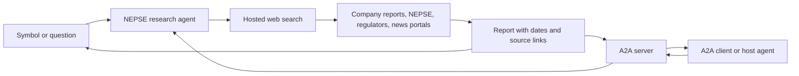

# NEPSE Research Agent

Give this agent `NABIL`, `EBL`, `NLIC`, or a question containing a NEPSE symbol.
It uses Gemini's Google Search tool, or OpenAI's hosted web-search tool, to
gather evidence across multiple websites and write a report. The A2A server
makes this researcher discoverable and callable by other agents.



## Run from the repository root

Requires Python 3.11+ and a Gemini or OpenAI API key with search access.
Gemini is selected when `GEMINI_API_KEY` is set; otherwise OpenAI is selected.
Set `NEPSE_PROVIDER=gemini` or `NEPSE_PROVIDER=openai` to choose explicitly.
Model settings are `GEMINI_MODEL` (default `gemini-3.5-flash-lite`) and
`OPENAI_MODEL` (default `gpt-5.5`). Provider API and search charges apply.

```bash
source .venv/bin/activate
python -m pip install -r requirements.txt
export GEMINI_API_KEY='your-api-key'
python -m nepse_agent research "NABIL"
```

Ask a more specific question, or save a report:

```bash
python -m nepse_agent research "EBL latest news, dividends and fundamentals"
python -m nepse_agent research "NLIC" > nlic-report.md
python -m nepse_agent research "NABIL" --json > nabil-report.json
```

Settings may be exported or placed in the repository's `.env` file. Exported
variables take precedence over values in that file.

## Internet search tool and source coverage

The Gemini request registers the actual search tool:

```python
config=types.GenerateContentConfig(
    tools=[types.Tool(google_search=types.GoogleSearch())],
    system_instruction=research_instructions,
)
```

The model is instructed to make separate searches for company identity, latest
market information, fundamentals and recent news. Search targets include
MeroLagani, ShareSansar, NEPSE, NepseAlpha, ArthaSarokar and the company's own
financial disclosures. Targets are instructions; the application reports only
sources returned by the search API and linked to claims in its response.

Reports must cite at least two distinct publisher domains. Duplicate URLs,
portal subdomains and NEPSE's alternate hostname do not increase this count.
An uncited search result does not count as evidence supporting the report.
Google grounding redirect links are retained for attribution; publisher names
or redirect destinations identify their domains. Unresolved publishers are not
counted. Source domains and the actual search queries are included in the JSON.

If the first response has insufficient source coverage or no usable search
evidence, one additional search request asks for broader coverage. If the second
response still fails the check, the agent returns an error. Provider errors
such as quota failures do not cause this search retry.

To require at least three sites:

```bash
export NEPSE_MIN_SITES=3
python -m nepse_agent research "NABIL news, quarterly results and dividends"
```

`NEPSE_MIN_SITES` accepts 2–10. Raising it may increase latency or make some
queries fail when enough public sources cannot be found. Two sites can repeat
the same original announcement, so the report still needs dated primary evidence
and comparable financial periods; source diversity alone does not verify facts.

Gemini's returned Google Search suggestions are preserved as
`search_suggestions_html`. The Streamlit UI renders them alongside the answer.
Other graphical clients should render those suggestions and the citation links.
The terminal prints Markdown; `--json` also exposes the HTML and search metadata.

## Use through A2A

Start the server in one terminal with the API key exported:

```bash
python -m nepse_agent serve
```

In another terminal, from the repository root:

```bash
source .venv/bin/activate
python -m nepse_agent ask "NABIL recent news and financial performance"
```

The root `main.py` entry point also starts this agent, on port 8000:

```bash
python main.py
```

Query that server with `python -m nepse_agent ask "NABIL" --url http://127.0.0.1:8000`.

The client does not need the provider key. The server publishes its agent card at
`http://127.0.0.1:10000/.well-known/agent-card.json` and accepts A2A 1.0 JSON-RPC
requests at `/`. It returns a Markdown report artifact and a JSON artifact
containing report text, the research timestamp, cited sources, publisher domains,
search queries, searched URLs and any Google Search suggestions HTML.
The JSON artifact does not extract individual financial metrics into JSON fields.
Raw HTTP clients must send `A2A-Version: 1.0`; the SDK client sets this header.
Streaming clients also receive task status and artifact events; report text is
returned when research finishes. Tasks are stored in memory for this local sample.

For a different reachable address, set the advertised URL:

```bash
python -m nepse_agent serve --host 127.0.0.1 --port 10001 --public-url http://127.0.0.1:10001
python -m nepse_agent ask "EBL" --url http://127.0.0.1:10001
```

## What the report asks the model to collect

| Area | Information |
| --- | --- |
| Company | Verified symbol, name, sector and instrument type |
| Market | Latest available quote, trading timestamp, change, volume, market cap, 52-week range |
| Fundamentals | EPS, P/E, book value, P/B, revenue, profit, ROE, capital and reporting period |
| News | Up to five relevant, distinct stories from the last 30 days, with dates and links |
| Corporate actions | Cash/bonus dividends, rights, book close, AGM and mergers when verified |
| Interpretation | Evidence-based observations, sector-specific metrics and missing/conflicting information |

The model is instructed to prefer company disclosures, NEPSE, SEBON and NRB;
public ShareSansar and MeroLagani pages supply supplementary data and news.
Example source pages: [MeroLagani company detail](https://www.merolagani.com/CompanyDetail.aspx?symbol=NABIL)
and [ShareSansar company profile](https://www.sharesansar.com/company/NABIL).

## How it works and how to extend it

- `agent.py` contains the research instructions, registered internet search tools,
  provider calls and citation renderers. Gemini's grounding metadata maps claims
  to source URLs; OpenAI's web-search annotations provide the same attribution.
  The research entry point rejects reports with insufficient cited-site coverage.
- `server.py` wraps that researcher in the same executor/task/card structure as
  the existing HelloWorld sample, using your installed A2A SDK 1.2.0.
- `client.py` demonstrates discovery and a request through the A2A client SDK.
- `__main__.py` provides the three terminal commands.

This is search-based research, not a licensed live market feed. A source can be
stale, unavailable or paywalled even with live web access enabled. The agent is
instructed to report the actual quote date and financial period, flag gaps,
preserve BS dates, and distinguish dividend percentages from dividend yields.
Those content rules are model instructions; the application does not validate
every figure, reporting period or citation-to-claim relationship.

For reliable numerical data in a larger application, add a `get_stock_snapshot`
tool backed by a permitted data API/feed, and a `get_financial_statements` tool
that extracts company filings into validated fields. Keep web search for news
and discovery, then let the model summarize the collected evidence. A2A handles
communication with the researcher; these tools handle data retrieval.

API details: [Gemini Google Search grounding](https://ai.google.dev/gemini-api/docs/generate-content/google-search)
and [OpenAI web search](https://developers.openai.com/api/docs/guides/tools-web-search).

## Verify locally

```bash
python -m pip install -r requirements-dev.txt
python -m pytest -q -p no:cacheprovider tests
```

The tests mock the provider API and exercise the A2A server in process, without
an API key or paid calls. A live report requires your configured API key.
