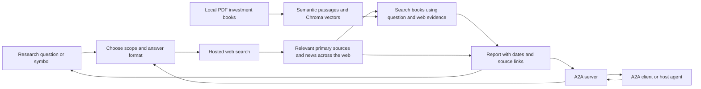

# NEPSE Research Agent

Give this agent a natural-language question, such as "Give me today's market
summary", "Latest Nepal economic news", "Compare NABIL and EBL", or a stock
symbol such as `NABIL`. A symbol is optional.
It uses Gemini's Google Search tool, or OpenAI's hosted web-search tool, to
gather evidence across multiple websites and write a report. The A2A server
makes this researcher discoverable and callable by other agents.
The shared research engine also retrieves investment-book passages from a
local RAG store and includes their book, chapter and PDF page references in
the model prompt. Full company reports request a financial scorecard and an
investment verdict based on the supplied context and current web evidence.



## Run from the repository root

Requires Python 3.11+ and a Gemini or OpenAI API key with search access.
Gemini is the default provider and requires only `GEMINI_API_KEY`.
OpenAI is optional: set `NEPSE_PROVIDER=openai` and `OPENAI_API_KEY` to use it.
Set `NEPSE_PROVIDER=gemini` to select Gemini explicitly.
Model settings are `GEMINI_MODEL` (default `gemini-3.5-flash-lite`) and
`OPENAI_MODEL` (default `gpt-5.5`). Provider API and search charges apply.

```bash
source .venv/bin/activate
python -m pip install -r requirements.txt
export GEMINI_API_KEY='your-api-key'
python -m nepse_agent research "NABIL"
```

Ask a more specific question, or save a report:

```bash
python -m nepse_agent research "EBL latest news, dividends and fundamentals"
python -m nepse_agent research "Give me today's market summary in 200 words"
python -m nepse_agent research "Which NEPSE sectors performed best this week?"
python -m nepse_agent research "Compare NABIL and EBL's latest quarterly results"
python -m nepse_agent research "NLIC" > nlic-report.md
python -m nepse_agent research "NABIL" --json > nabil-report.json
```

Settings may be exported or placed in the repository's `.env` file. Exported
variables take precedence over values in that file. Both `GEMINI_API_KEY=...`
and `export GEMINI_API_KEY=...` are accepted in `.env`.

## Local book retrieval and stock assessment

Place PDF books directly in the repository's `training_books/` directory.
The first book-retrieval request creates `training_books/.rag_index.json`,
`.rag_vectors/` and `.embedding_models/`. To build these before research:

```bash
python -m nepse_agent index-books
```

This directory is git-ignored, so provide the books on every installation.

`rag_engine.py` extracts PDF text with `pypdf`, embeds sentences locally with
FastEmbed (`BAAI/bge-small-en-v1.5`), and computes a cosine similarity matrix to
split at shifts in meaning. Passages remain within their original PDF page and
are capped at 180 words by default. Chroma persists the passage embeddings and
ranks vector queries using cosine similarity; low-scoring matches are omitted.

For a bare symbol or an analysis/investment question, the first provider request
gathers cited web evidence. The question, short sections of that response and
investing topics drive vector queries; up to eight distinct passages go into
a second search-enabled request for the assessment. Set `NEPSE_RAG_WEB_FIRST=0`
to use question-only retrieval before a single research stage. General market
summaries and news keep one stage by default. These flows apply to both model
providers and all interfaces. Stock assessments use the financial scorecard;
other questions retain their requested scope.

SHA-256 book fingerprints detect added, removed or changed PDFs and rebuild the
cache. Changed embedding models or chunking settings also trigger reindexing;
legacy TF-IDF caches migrate automatically. `NEPSE_BOOKS_DIR` selects another
PDF directory, `NEPSE_BOOK_INDEX` selects the manifest, and `NEPSE_VECTOR_DB`
selects Chroma storage. `NEPSE_EMBEDDING_MODEL` selects a supported FastEmbed
model; `NEPSE_EMBEDDING_CACHE` selects its download cache. Embeddings run locally
after the initial model download, without a separate API key or fine-tuning.
PDFs, the manifest and vectors stay local; selected passages go to the research
provider. The web-first flow adds a model call and can increase latency and cost.

Pages without usable text are skipped and reported in `BookRAGStore.warnings`
and `book_status`. Optional macOS OCR is available through
`python -m nepse_agent index-books --ocr` or
`BookRAGStore().load_or_build(ocr=True)` and requires Swift. It caches recognized
English text beside the index without changing the PDFs. See the
[RAG setup guide](../README.md#rag-analyze-stocks-using-investment-books) for
copyable inspection, OCR and rebuilding examples.

INFO logs print the web response used for retrieval, every exact vector query,
cosine similarity scores, rejected matches and the book context passed to the
model. `book_sources` in JSON reports exposes the supplied passages and their
metadata, including their retrieval scores; `cited_sources` holds web sources.
The model uses supplied `[BOOK:chunk_id]` citations. Unknown IDs, unverified
book-reference brackets and missing required book citations are rejected;
accepted markers render as filename/chapter/PDF-page references. This validates
citation identities, not the truth of every financial claim or calculation.
If retrieval fails or no match qualifies, the prompt marks book evidence as
unavailable and forbids invented book references. Check the source passages
when reviewing the generated rationale.

## Internet search tool and source coverage

Gemini HTTP 500/502/503/504 failures get up to three generation attempts, with
exponential backoff and jitter. Each stage shares a 180-second generation
deadline across all attempts and delays. Retry logs include the HTTP status,
model, attempt number and delay. A retry repeats only the failed generation;
it does not rerun completed research or book retrieval. Authentication,
configuration and quota errors stop immediately with status-specific guidance.
If temporary failures persist, the UI reports that Gemini is unavailable after
three attempts, rather than suggesting the API key is necessarily wrong.

The Gemini request registers the actual search tool:

```python
config=types.GenerateContentConfig(
    tools=[types.Tool(google_search=types.GoogleSearch())],
    system_instruction=research_instructions,
)
```

The model chooses the intent, entities, market, timeframe and answer format from
the question within the same search-enabled request. It starts with broad web
searches, then makes focused searches for relevant facts and primary sources.
Company identity and financial statements are researched when the question
needs them. An overall market summary does not request a company report.

There is no website allowlist. Example Nepal finance sources include NEPSE,
SEBON, NRB, company disclosures, ShareSansar, MeroLagani, NepseAlpha,
ArthaSarokar, Onlinekhabar and The Kathmandu Post. Other topics and countries
use appropriate sources. Targets are instructions; the application reports
only sources returned by the search API and linked to claims in its response.
It retrieves relevant public evidence, not every page on the internet.

Reports must cite at least two distinct publisher domains. Duplicate URLs,
portal subdomains and NEPSE's alternate hostname do not increase this count.
An uncited search result does not count as evidence supporting the report.
Google grounding redirect links are retained for attribution; publisher names
or redirect destinations identify their domains. Unresolved publishers are not
counted. Source domains and the actual search queries are included in the JSON.

If the first response has insufficient source coverage or no usable search
evidence, one additional search request asks for broader coverage. If the second
response still fails the check, the agent returns an error. Provider errors
such as quota failures do not cause this search retry.

To require at least three sites:

```bash
export NEPSE_MIN_SITES=3
python -m nepse_agent research "NABIL news, quarterly results and dividends"
```

`NEPSE_MIN_SITES` accepts 2–10. Raising it may increase latency or make some
queries fail when enough public sources cannot be found. Two sites can repeat
the same original announcement, so the report still needs dated primary evidence
and comparable financial periods; source diversity alone does not verify facts.

Gemini's returned Google Search suggestions are preserved as
`search_suggestions_html`. The Streamlit UI renders them alongside the answer.
Other graphical clients should render those suggestions and the citation links.
The terminal prints Markdown; `--json` also exposes the HTML and search metadata.

The CLI, `main.py` server and Streamlit UI enable research `INFO` logs on stderr.
They show the user query, each attempt's provider/model, Gemini request/response
progress, grounding chunk counts, Google Search queries, and the report's cited
publisher domains. Logs stay separate from reports and JSON written to stdout.
Each entry includes the logger's module name, source filename, line number and
function name, for example `nepse_agent.agent [agent.py:558 | research]`.
When the UI uses A2A, research logs appear in the server's terminal; direct
fallback research logs appear in the Streamlit terminal. Python integrations
can call `configure_research_logging()` from `nepse_agent.agent` to enable the
same output, or configure the `nepse_agent` logger themselves.

## Use through A2A

Start the server in one terminal with the API key exported:

```bash
python -m nepse_agent serve
```

In another terminal, from the repository root:

```bash
source .venv/bin/activate
python -m nepse_agent ask "NABIL recent news and financial performance"
```

The root `main.py` entry point also starts this agent, on port 8000:

```bash
python main.py
```

Query that server with `python -m nepse_agent ask "NABIL" --url http://127.0.0.1:8000`.

The client does not need the provider key. The server publishes its agent card at
`http://127.0.0.1:10000/.well-known/agent-card.json` and accepts A2A 1.0 JSON-RPC
requests at `/`. It returns a Markdown report artifact and a JSON artifact
containing report text, the research timestamp, cited sources, publisher domains,
search queries, searched URLs and any Google Search suggestions HTML.
The JSON artifact does not extract individual financial metrics into JSON fields.
Raw HTTP clients must send `A2A-Version: 1.0`; the SDK client sets this header.
Streaming clients also receive task status and artifact events; report text is
returned when research finishes. Tasks are stored in memory for this local sample.

For a different reachable address, set the advertised URL:

```bash
python -m nepse_agent serve --host 127.0.0.1 --port 10001 --public-url http://127.0.0.1:10001
python -m nepse_agent ask "EBL" --url http://127.0.0.1:10001
```

## How the question shapes the answer

| Query | Expected answer |
| --- | --- |
| "Give me today's market summary" | Actual trading session, index movement, turnover, breadth, sectors, gainers/losers and relevant news, where verified |
| "Latest IPO announcements in Nepal" | Dated announcements, their status and source links |
| "Compare NABIL and EBL" | A comparison using the same financial periods and units where available |
| "How do interest rates affect share prices?" | A direct explanation supported by relevant sources |
| "NABIL" | A full company report covering the areas below |

Unqualified market questions default to NEPSE/Nepal, with the assumption stated
in the answer. Explicitly named countries or markets take precedence. Questions
outside Nepal finance are researched on their own terms. The model follows the
user's requested language, length and format; a focused stock question only
includes relevant sections.

"Today" is resolved using the supplied research date in Asia/Kathmandu, with
the trading timezone identified for another market. The model must verify the
actual session date, label provisional intraday data, and identify the latest
verified session when today's figures cannot be found. A closure or holiday
must be verified before being asserted. These are model instructions, not a
guarantee that every source has fresh or complete data.

For a full company report:

| Area | Information |
| --- | --- |
| Company | Verified symbol, name, sector and instrument type |
| Market | Latest available quote, trading timestamp, change, volume, market cap, 52-week range |
| Fundamentals | EPS, P/E, book value, P/B, revenue, profit, ROE, capital and reporting period |
| Book-based scorecard | Pass / Caution / Fail assessment of profitability, leverage, cash flow and valuation |
| Investment verdict | Qualified assessment with strengths, risk flags and references to book principles |
| News | Up to five relevant, distinct stories from the last 30 days, with dates and links |
| Corporate actions | Cash/bonus dividends, rights, book close, AGM and mergers when verified |
| Interpretation | Evidence-based observations, sector-specific metrics and missing/conflicting information |

The model is instructed to prefer company disclosures, NEPSE, SEBON and NRB;
public ShareSansar and MeroLagani pages supply supplementary data and news.
Example source pages: [MeroLagani company detail](https://www.merolagani.com/CompanyDetail.aspx?symbol=NABIL)
and [ShareSansar company profile](https://www.sharesansar.com/company/NABIL).

## How it works and how to extend it

- `agent.py` contains the research instructions, registered internet search tools,
  book-context injection, provider calls and citation renderers. The instructions
  select the research approach and relevant answer sections from the query.
  Gemini's grounding metadata maps claims
  to source URLs; OpenAI's web-search annotations provide the same attribution.
  The research entry point rejects reports with insufficient cited-site coverage.
- `rag_engine.py` manages local PDF extraction, semantic chunks, FastEmbed vectors,
  retrieval, cache freshness and optional OCR. `ocr_books.swift` recognizes
  scanned pages using macOS PDFKit and Vision.
- `server.py` exposes the researcher through A2A agent discovery, JSON-RPC
  requests, task updates and report artifacts using A2A SDK 1.2.0.
- `client.py` demonstrates discovery and a request through the A2A client SDK.
- `__main__.py` provides research, serve, ask and index-books commands.

This is search-based research, not a licensed live market feed. A source can be
stale, unavailable or paywalled even with live web access enabled. The agent is
instructed to report the actual quote date and financial period, flag gaps,
preserve BS dates, and distinguish dividend percentages from dividend yields.
Those content rules are model instructions; the application does not validate
every figure, reporting period or citation-to-claim relationship.

For reliable numerical data in a larger application, add a `get_stock_snapshot`
tool backed by a permitted data API/feed, and a `get_financial_statements` tool
that extracts company filings into validated fields. Keep web search for news
and discovery, then let the model summarize the collected evidence. A2A handles
communication with the researcher; these tools handle data retrieval.

API details: [Gemini Google Search grounding](https://ai.google.dev/gemini-api/docs/generate-content/google-search)
and [OpenAI web search](https://developers.openai.com/api/docs/guides/tools-web-search).

## Verify locally

```bash
python -m pip install -r requirements-dev.txt
python -m pytest -q -p no:cacheprovider tests
```

The tests mock the provider API and exercise the A2A server in process, without
an API key or paid calls. A live report requires your configured API key.
